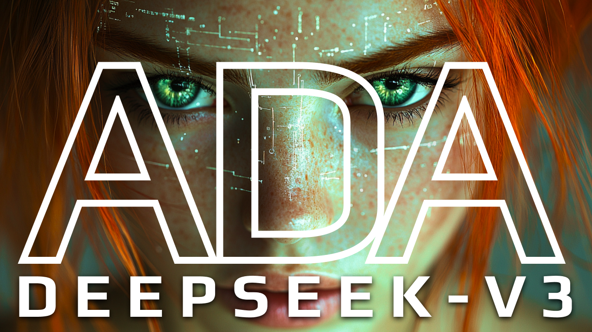

# "Always-On" Deepseek AI Assistant
> A pattern for an always on AI Assistant powered by Deepseek-V3, RealtimeSTT, and Typer for engineering
>
> Checkout [the demo](https://youtu.be/zoBwIi4ZiTA) where we walk through using this always-on-ai-assistant.



## Setup
- `cp .env.sample .env`
  - Update with your keys `DEEPSEEK_API_KEY` and `ELEVEN_API_KEY`
- `uv sync`
- (optional) install python 3.11 (`uv python install 3.11`)


## Commands

### Base Assistant Chat Interface
> See `main_base_assistant.py` for more details.
Start a conversational chat session with the base assistant:

```bash
uv run python main_base_assistant.py chat
```

### Typer Assistant Conversational Commands
> See `main_typer_assistant.py`, `modules/typer_agent.py`, and `commands/template.py` for more details.

- `--typer-file`: file containing typer commands
- `--scratchpad`: active memory for you and your assistant
- `--mode`: determines what the assistant does with the command: ('default', 'execute', 'execute-no-scratch').

1. Awaken the assistant
```bash
uv run python main_typer_assistant.py awaken --typer-file commands/template.py --scratchpad scratchpad.md --mode execute
```

2. Speak to the assistant
Try this:
"Hello! Ada, ping the server wait for a response" (be sure to pronounce 'ada' clearly)

3. See the command in the scratchpad
Open `scratchpad.md` to see the command that was generated.

## Assistant Architecture
> See `assistant_config.yml` for more details.

### Typer Assistant
> See `assistant_config.yml` for more details.
- 🧠 Brain: `Deepseek V3`
- 📝 Job (Prompt(s)): `prompts/typer-commands.xml`
- 💻 Active Memory (Dynamic Variables): `scratchpad.txt`
- 👂 Ears (STT): `RealtimeSTT`
- 🎤 Mouth (TTS): `ElevenLabs`

### Base Assistant
> See `assistant_config.yml` for more details.
- 🧠 Brain: `ollama:phi4`
- 📝 Job (Prompt(s)): `None`
- 💻 Active Memory (Dynamic Variables): `none`
- 👂 Ears (STT): `RealtimeSTT`
- 🎤 Mouth (TTS): `local`


## Resources
- LOCAL SPEECH TO TEXT: https://github.com/KoljaB/RealtimeSTT
- faster whisper (support for RealtimeSTT) https://github.com/SYSTRAN/faster-whisper
- whisper https://github.com/openai/whisper
- examples https://github.com/KoljaB/RealtimeSTT/blob/master/tests/realtimestt_speechendpoint_binary_classified.py
- elevenlabs voice models: https://elevenlabs.io/docs/developer-guides/models#older-models